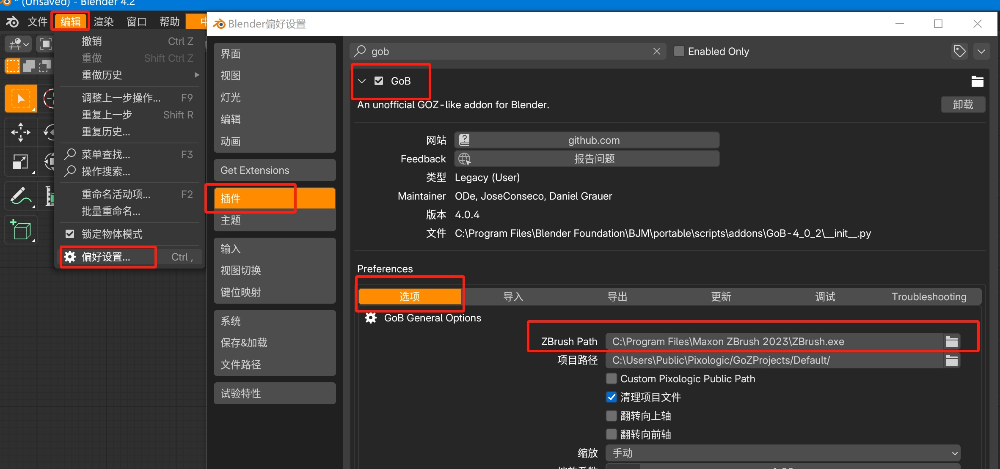
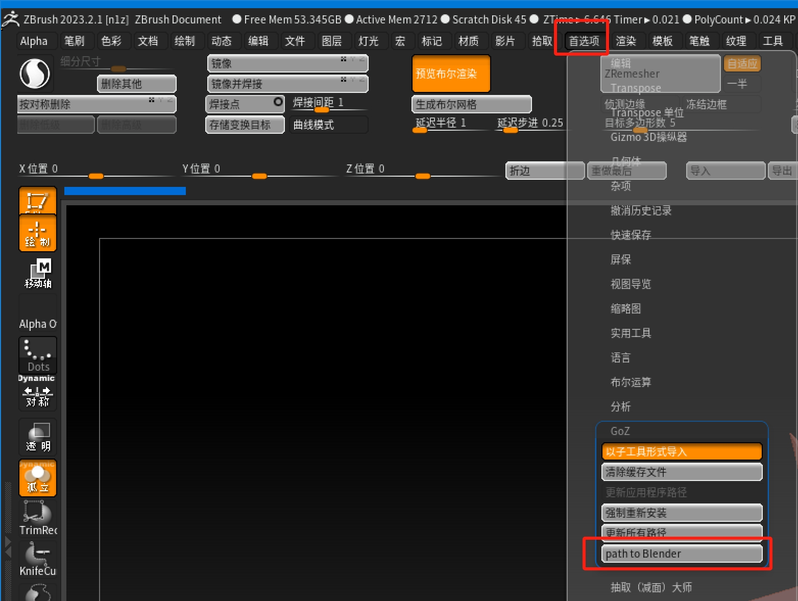
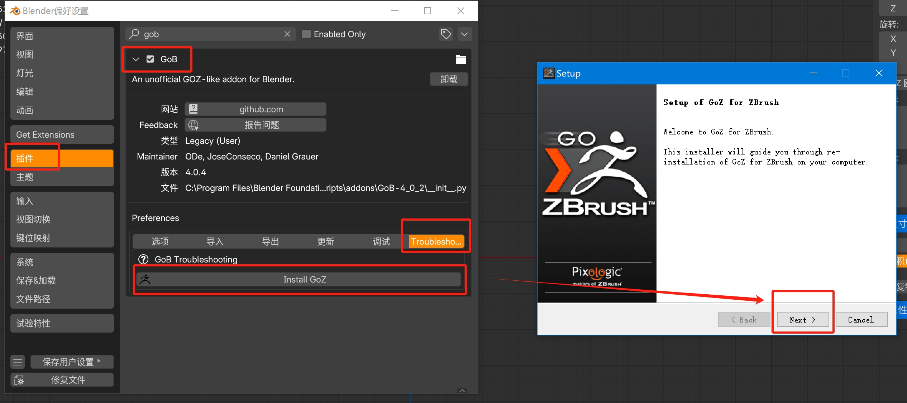

1. 点击 **导出** 时出现以下弹窗，是没正确设置 ZBrush 路径导致的

下图为设置方法（**右键** ZBrush 快捷方式 **打开文件所在位置** 获取路径）

   

2. Go 到 ZBrush 的物体变成六角星/ZB闪退，检查是否选中物体为活动物体（默认主题下为橙色轮廓线）、物体名称是否有汉字、物体有无实现实例。

3. ZBrush GoB 失败，根据下图正确设置 Blender 路径。（通常在 Blender 点击 **导出** 即可安装 Blender 到 GoZ ，若无 path to Blender 选项，重启ZBrush，还是没有就请看第4步安装 GoZ，安装完重启Zbrush。）

4. 同时选中的物体 GoZ 后拆分开，需要重装 GoZ（安装前需关闭 ZBrush，重复点击下一步即可）

   

5. 注意事项：

   - 物体名字不能带汉字！！！
   - GoZ前先更新大小比例。
   - 卸载 ZBrush 时候，不要勾选卸载 GOZ 插件选项。
   - 通常GoB物体需要减面，否则会造成Blender卡顿。
   - 回到Blender的物体名字不得带有与 **细分** 之类会极大增加面数的修改器，否则会造成软件负载过大崩溃。

6. 报错解决视频：https://www.bilibili.com/video/BV1Wf4y1p7eg/
