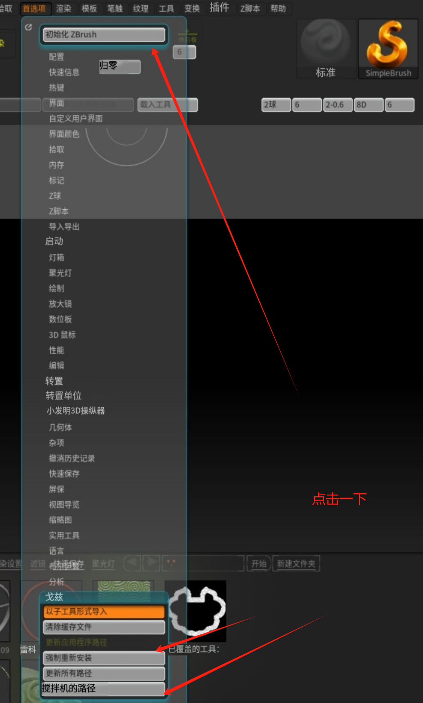
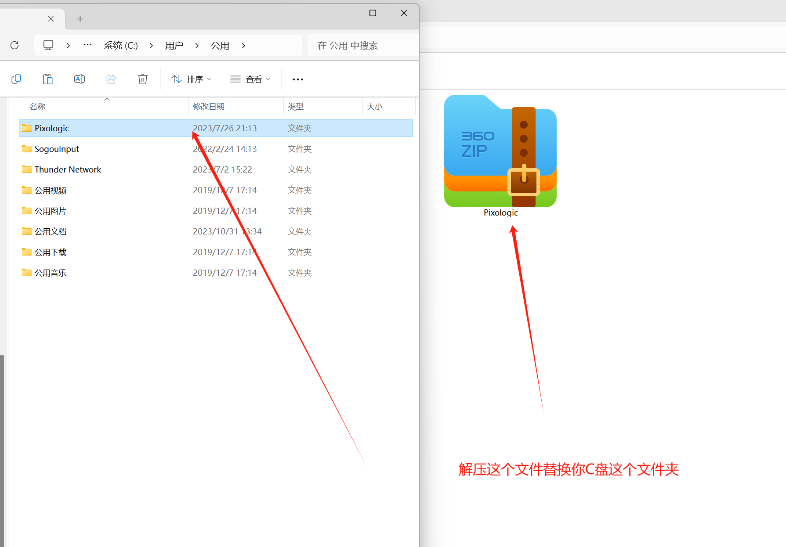

## Blender>ZBrush失败

1. 物体必须为实体（是否勾选实现实例）

2. 传输物体名字/文件名字必须无汉字，无除下划线外的特殊符号

3. gob插件zbrush路径是否填写正确

   

## ZBrush>Blender失败

+ 卸载ZB时候，不要勾选卸载GOZ插件选项。

+ 重置化路径，然后重新覆盖ZB GOZ插件目标文件夹所有文件

  
  

**其他注意事项**

+ 文件点击一下封闭孔洞，以及修复网格，这样GOZ效果更好
+ 插件安装教程: https://www.bilibili.com/video/BV1zG411Q7ns
+ blender 插件下载：https://github.com/JoseConseco/GoB/archive/refs/tags/v4_0_2.zip
+ 报错/解决方案：https://www.bilibili.com/video/BV1Wf4y1p7e

