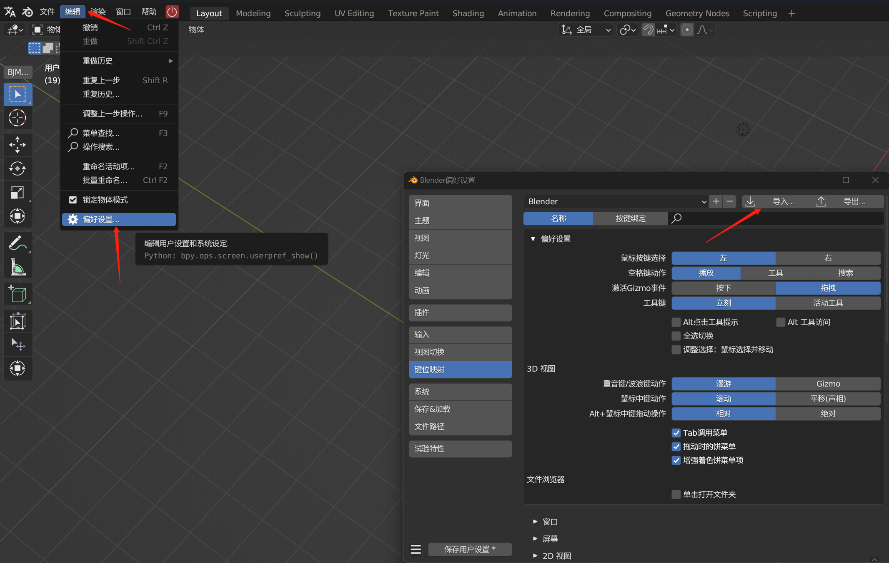

## 自定义安装问题

### 我要安装使用blender原生的/预设好的快捷键怎么办

下载此文件 [默认快捷键.py](https://gitee.com/atticus-lv/bjm-document/tree/master/docs/QA/res/默认快捷键.py) 并导入。在下拉框选中之后即可切换为默认快捷键，

下载此文件 [BJM快捷键.py](https://gitee.com/atticus-lv/bjm-document/tree/master/docs/QA/res/BJM快捷键.py) 并导入。在下拉框选中之后即可切换为我们预设的快捷键，保存偏好设置并重启blender就能在之后的使用中使用这套快捷键

