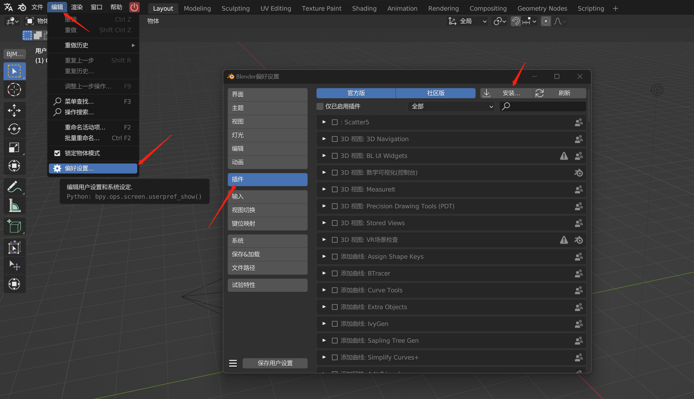

## 一键安装问题

### 1. 一键安装器无法下载blender

+ 进度条停留在**准备下载资源...**

  请检查是否存在C盘桌面，如不存在，请在`C:\Users\{你的用户名}\`下建立名为`Desktop`的文件夹

### 2. Blender无法打开怎么办？

+ 如果黑框内出现如下报错，基本是因为使用了**中文用户名**导致了路径错误

  ```
  Could not find the Qt platform plugin "windows" in ""
  This application failed to start because no Qt platform plugin could be initialized. Reinstalling the application may fix this problem.
  ```

  请添加如下环境变量（如果不知道环境变量如何添加请百度）

  变量名：`QT_QPA_PLATFORM_PLUGIN_PATH`

  变量值：`C:\Users\{你的用户名}\AppData\Roaming\Blender Foundation\Blender\{blender版本号}\scripts\addons\ad_jewel_tools-pro\modules\PySide2\plugins\platforms\`

+ 如果出现弹窗并显示，基本是因为**显卡驱动**版本过低

  ```
  A graphics card and driver with support for OpenGl 3.3 or higher is required
  ```

  请自行百度更新显卡驱动，n卡用户可以使用Nvidia Experience更新

---

## 自定义安装问题

### 如何自定义安装

安装blender插件，并把所有的插件安装进去。



### 我要安装使用blender原生的/预设好的快捷键怎么办？

下载此文件(打开页面后ctrls保存) [默认快捷键.py](https://gitee.com/atticus-lv/bjm-document/raw/master/docs/QA/res/默认快捷键.py) 并导入。在下拉框选中之后即可切换为默认快捷键，

下载此文件(打开页面后ctrls保存) [BJM快捷键.py](https://gitee.com/atticus-lv/bjm-document/raw/master/docs/QA/res/BJM快捷键.py) 并导入。在下拉框选中之后即可切换为我们预设的快捷键，保存偏好设置并重启blender就能在之后的使用中使用这套快捷键


