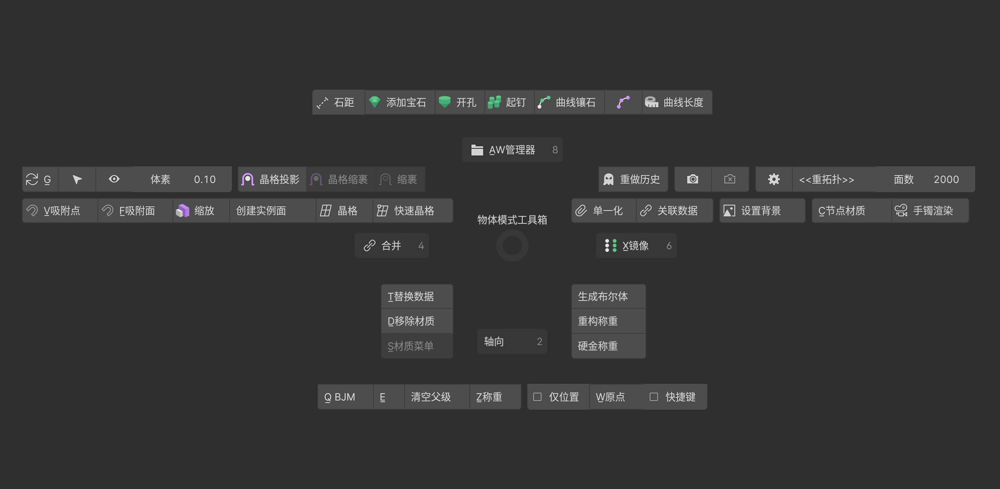
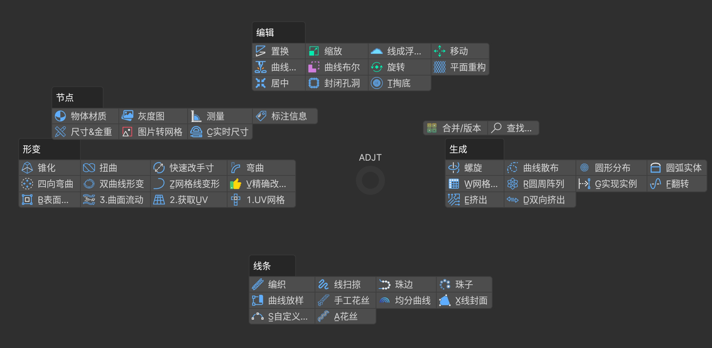
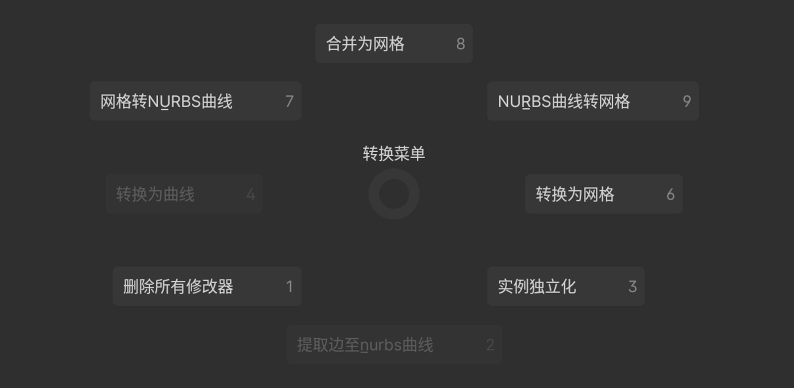
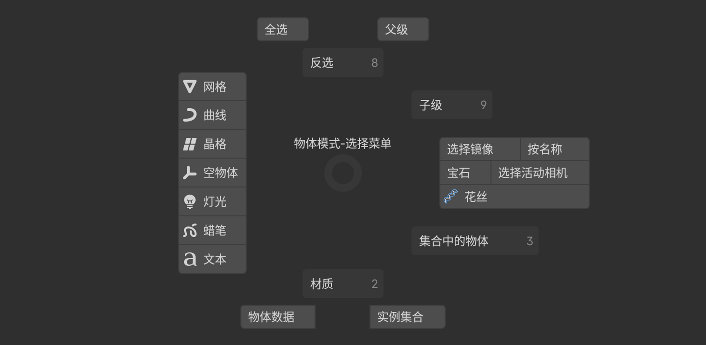
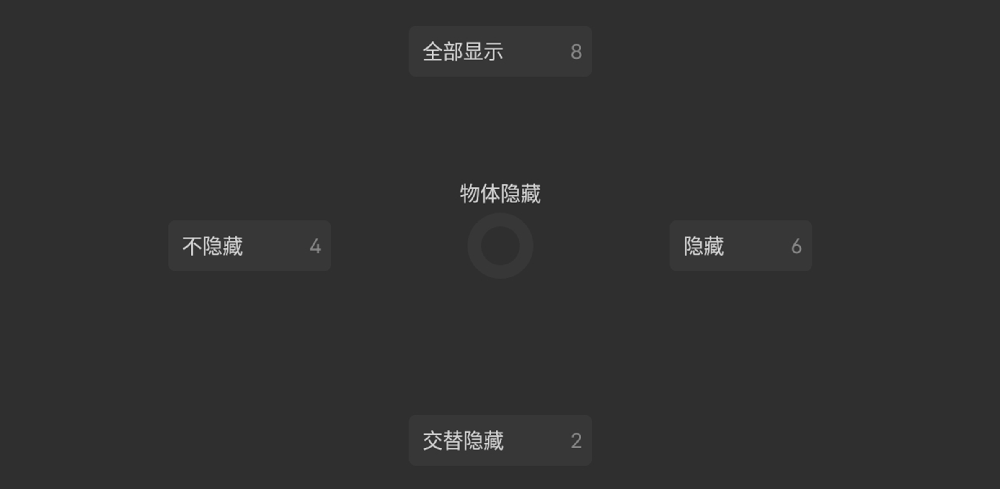

## 物体模式工具箱(Q)

1. 上方为镶嵌的常用功能,开虎爪要转到JewelCraft插件面板
2. 晶格投影 `单个轴向用晶格将被选物体投影吸附至活动物体.`
3. 晶格缩裹 `顶视图以晶格为父级将被选物体吸附至活动物体,可选择晶格G,R,S变换随时调整位置.`
4. 缩裹 `一般用于非实体网格以所在视图投影至活动物体.`
5. 缩放 `将选定对象以单个轴向为基准缩放到指定大小.`
6. 创建实例面 `选中物体移至指定集合并用节点实例,规范操作为物体以顶视图正确朝向 、物体原点在世界中心.`
7. 快速晶格 `适配选中物体形状新建晶格修改器,左方'晶格'为调整晶格参数按钮.`
8. 重做历史 `以文字列表的形式显示操作历史动作,可选重做特地历史.`
9. 渲染可见/禁用 `快速开启物体的全部对于摄像机光线的可见性.`
10. 重拓扑功能 `设置重拓扑对称轴向 面数 确认重构按钮.`
11. 单一化/关联 `将网格数据从活动物体独立/传递到指定的物体.`
12. 合并 `将选中物体合并到活动物体.`
13. 镜像 `围绕一个或多个轴镜像选定对象，产生新的物体.`
14. 生成布尔体 `合并重构并精简选中的物体,以便于布尔使用.`
15. 重构称重 `合并选中的物体(必须要有活动物体),添加重构修改器,偏移x轴出来然后称重.`
16. 硬金称重 `指定电镀的厚度,精确模拟测量硬金重量.`
17. 清空父级 `清除父级并保留变换结果.`
18. 仅位置 `仅变换物体位置，而不影响旋转或缩放.`
19. 快捷键 `开启热键显示,一般用于录屏或演示使用.`

以下为Q+快捷键功能

- QA:资产管理器 `快捷调用资产.`
- QS:材质菜单 `设置物体的材质,可同时设置多个物体.`
- QC:节点材质 `用于设置QS菜单无效,节点生成物体的材质,仅对活动物体有效.`
- QD:移除材质 `移除选中物体的全部材质.`
- QW:仅原点 `变换物体原点,同时保持形状位置不变.`
- QG:更新体素布尔 `快速更新修改过的体素布尔的物体或集合,后两个按钮分别为选/不选、显/隐 布尔物体`
- QV,QF:吸附点/面 `一键设置吸附点/面的快速预设,并开启吸附功能.`
- QZ:称重 `根据密度计算活动物体的重量,有互相穿插的网格会重复计算导致金重增加.`
- QE:称重重命名 `根据密度计算活动物体的重量,复制到剪切板,然后重命名物体后缀.`
- QQ:BJM菜单,如下

## BJM菜单(Q,Q)

> ###### 编辑

1. 置换 `预设多个常用置换灰度图,可在修改器面板快速调整UV.`
2. 移动/旋转/缩放 `参数化变换物体.`
3. 线成浮雕片 `以顶视图且网格Z轴=0生成浮雕片.`
4. 曲线置换 `选择曲线/网格线对物体刻线.(性能较低,建议使用自定义曲线描线然后体素布尔.)`
5. 曲线布尔 `以视图投影的形式布尔(裁剪)物体,运算速度比传统布尔快且不会布尔失败.`
6. 平面重构 `增加单一平面物体的面数,作变形使用.`
7. 居中 `指定一个或多个轴镜像居中物体.`
8. 封闭孔洞 `用节点快速封闭开放网格的孔洞.`
9. 节点合并 `用几何节点合并选中的物体,一般用于整体变形、渲染.`

- Q,QT:掏底 `对封闭的网格指定厚度掏底，可仅保留内壳.`

> ###### 节点

1. 物体材质 `用几何节点的方式赋予物体材质.`
2. 灰度图 `配合BJM插件面板的'存储物体属性到图像'使用,模型生成灰度图.`
3. 测量 `显示网格两点的直线距离,用以标注模型尺寸.`
4. 标注信息 `特定字符串+网格箭头指向物体.`
5. 尺寸&金重 `可选物体多视图,标注尺寸+金重,与称重功能同理,如网格有穿插则会重复计算.`
6. 图片转网格 `用网格物体在修改器面板指定图像生成像素对应的网格.`

- Q,QC:实时尺寸 `实时显示在任意修改器之后的物体尺寸.`

> ###### 形变

1. UV网格 `节点展UV用于展开没有网格面的物体、网格->UV一般与原始网格配合表面形变用于反向展开曲面物体`
2.
获取UV `获取指定物体的UV属性至网格形态,物体模式移动旋转缩放或晶格变形可应用至指定物体的UV变换,使曲面流动能更灵活控制.`
3. 曲面流动 `需确保形变物体与曲面的位置、旋转、缩放都为默认值,1模式为3、1+3使用，2模式为2+3、1+2+3使用.`
4. 锥化 `高级梯形化,可调节中间弧度、控制影响范围.`
5. 扭曲 `沿指定的坐标轴进行旋转.`
6. 快速改手寸 `设置正确的原手寸,快速缩放戒指、手镯的大小,加上对应手寸编号.`
7. 弯曲 `沿指定的坐标轴进行网格弯曲.`
8. 四向弯曲 `以顶/前视图为基准,球形化弯曲网格.`
9. 双曲线形变 `一般用于需要两条曲(网格)线形变的手镯/戒指,可启用任意一/两条曲线形变.`

- Q,QZ:网格线变形 `网格线版的曲线修改器,可调节倾斜 结束点等多个曲线参数.`
- Q,QV:精确改手寸 `可设置任意保护区域,精确改戒指/手镯的手寸.`
- Q,QB:表面形变 `与形态键结合使用实时变形(除曲面编辑模式外),改变网格点数后不用反复绑定/解绑.`

合并/版本 `使用几何节点合并选中项为一个物体,一般用于渲染或整体形变.`

> ###### 生成

1. 螺旋 `围绕一个轴向进行车面,将内出网格视为轮廓,可重建切面段数.`
2. 曲线散布 `在一条线上按个数/间隔距离散布物体.`
3. 圆形分布 `在指定大小的圆形范围内以中心为朝向分布物体.`
4. 圆弧实体 `快速生成一个可调节弧度的实体.`

- Q,QW:网格阵列 `以自身为中心网格阵列物体,可选交叉、范围,单行阵列即为居中的自带阵列修改器.`
- Q,QR:圆周阵列 `沿指定的坐标轴进行参数化圆周阵列复制.`
- Q,QG:实现实例 `将几何节点的实例转换成真实的几何网格.`
- Q,QF:翻转 `沿指定的坐标轴进行180°旋转复制物体.`
- Q,QE:挤出 `以顶/前视图的朝向挤出网格,自带细分\卡边,多数情况下优于实体化修改器.`
- Q,QD:双向挤出 `沿指定的坐标轴进行双向挤出物体.`

> ###### 线条

1. 编织 `沿路径生成编织网格.`
2. 线扫掠 `沿路径扫掠两次,合并为带凹槽的网格.`
3. 珠边 `在线上按距离实例珠子,可按视图压平,底边可对齐指定物体法向.`
4. 珠子 `用网格点生成珠子,可调节网格属性单个改变大小.`
5. 曲线放样 `复制网格线按顺序放样成面,不限网格线点数.`
6. 手工花丝 `模拟手工缠绕花丝,较为卡顿,流畅版本直接用A花丝节点新功能.`
7. 均分曲线 `两条线段之间均等偏移出对应数目的网格.`

- Q,QX:线封面 `细分路径并按视图封面,可选封面-布尔快速描字体.`
- Q,QS:自定义曲线 `参数化单导轨,可实时变换无数种切面.`
- Q,QA:花丝 `参数化麻绳,实时流畅调整数据,集成绝大部分用途.`

## 转换饼菜单(Alt+C)

> 转换物体的类型,应用/删除全部修改器/应用&合并以便出货使用,实例独立化.

## 选择菜单(A拖拽)

> 按物体关系、类型、名称、修改器、集合选择物体.

## 物体隐藏(H)

> 物体层面的隐藏/显示/交替隐藏.

## 添加预设物体(Shift+A拖拽)

  
  

    <strong style="color:gray;">快速添加常用物体</strong>
  

## 复制属性(Ctrl+C)

  
  

    <strong style="color:gray;">复制选中物体、活动物体的修改器、位置旋转缩放</strong>
  

