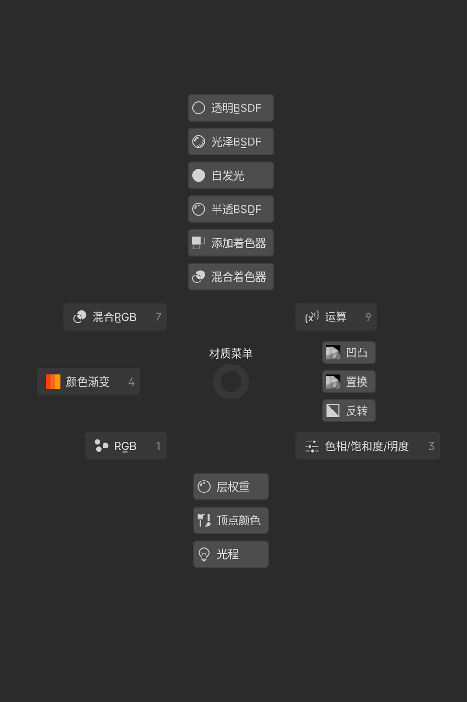
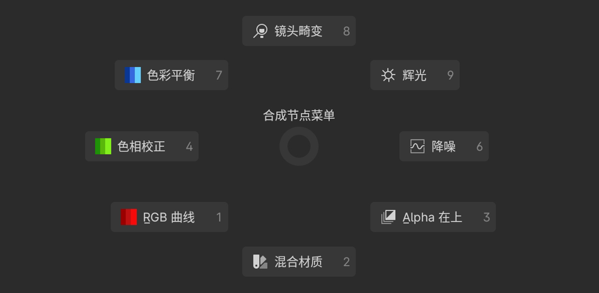
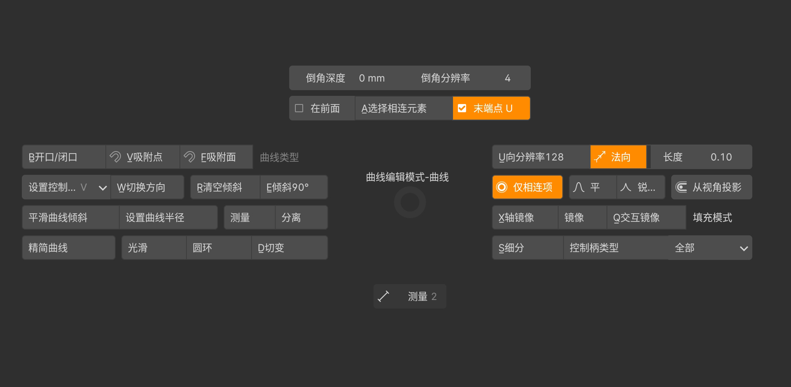
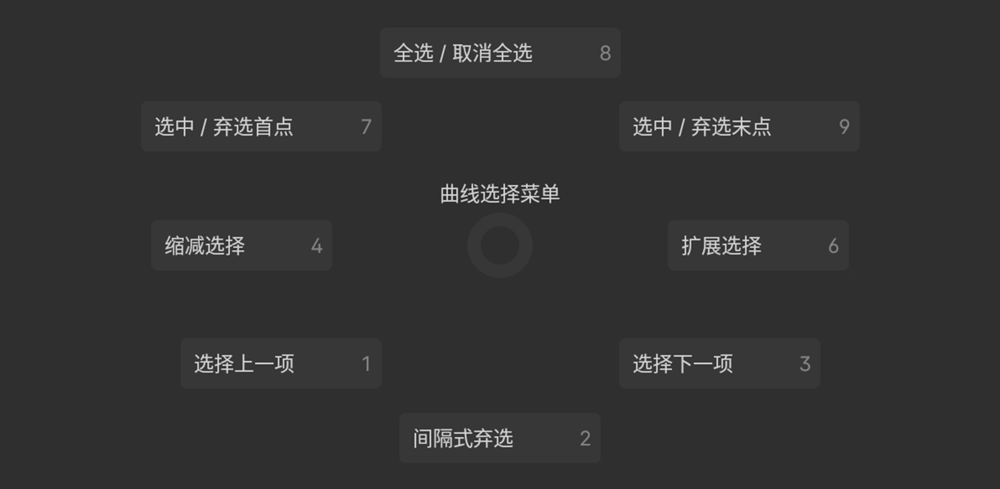
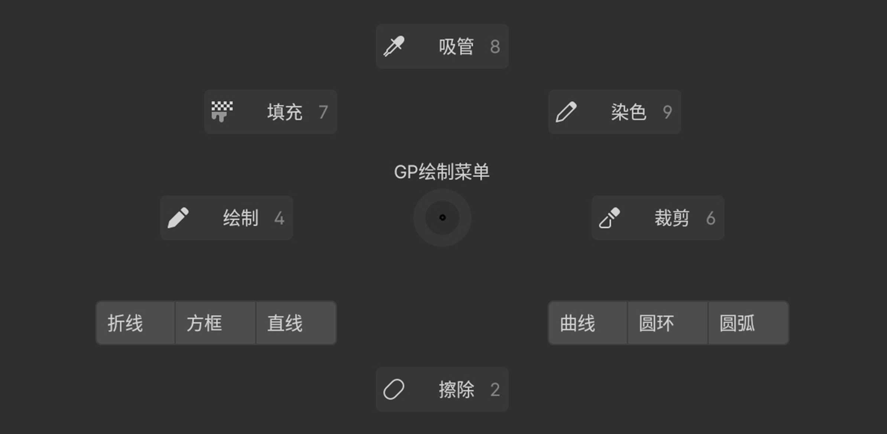
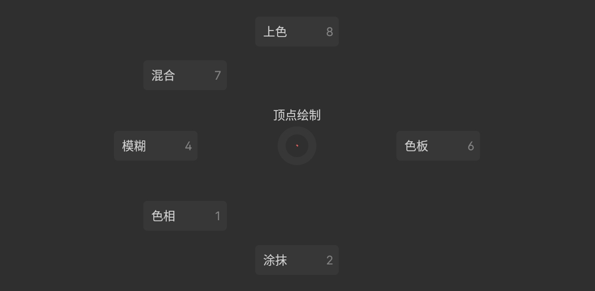
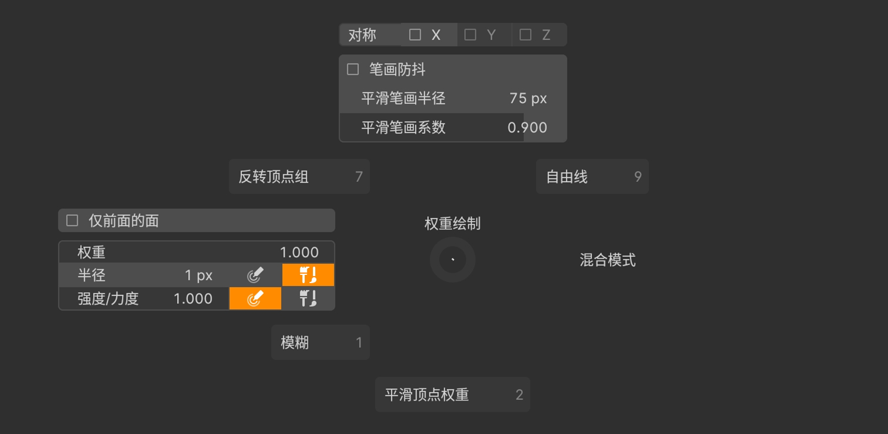
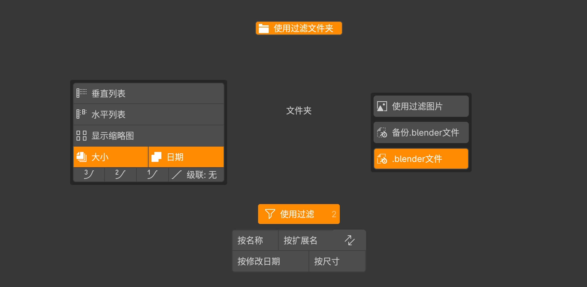

### 节点菜单

#### 材质菜单(Q)

> 着色编辑器快速添加节点的菜单

#### 合成菜单(Q)

> 合成器快速添加节点的菜单.

------

## 曲线编辑模式

#### 曲线编辑菜单(Q)

> 曲线编辑模式常用的功能集成.

#### 曲线选择菜单(A拖拽)

#### GP绘制菜单(Q)

------

## 绘制模式

#### 顶点绘制(Q)

#### 权重绘制(Q)

------

## 其他菜单

#### 文件夹菜单(Q)

