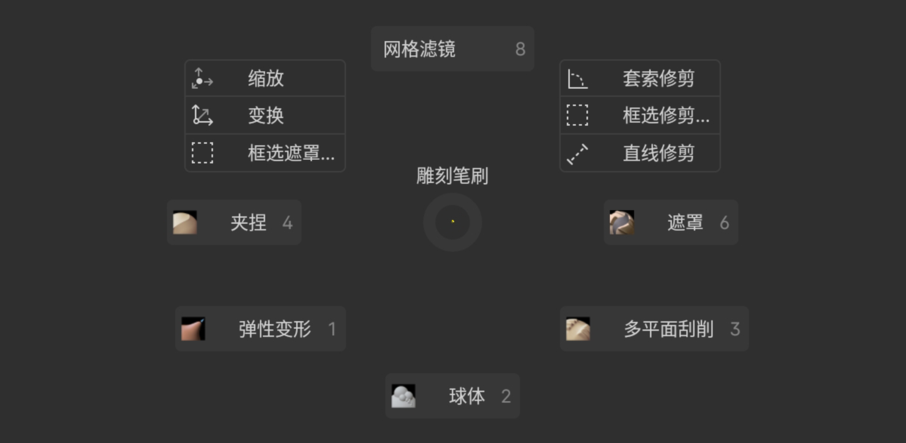
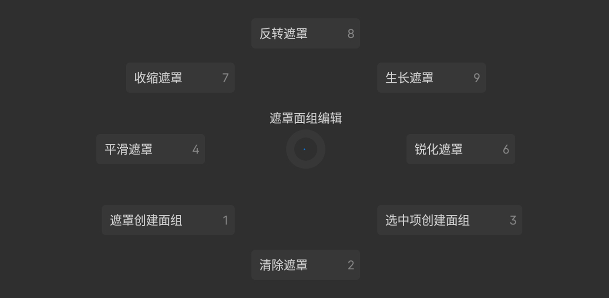

## 雕刻工具(Q)

> 设置笔刷、镜像、径向对称、雕刻遮蔽、面组、重构、动态拓扑.

- QX,QY,QZ:仅X/Y/Z轴 `锁定其他两个轴,仅Z/Y轴可雕刻.`

- QQ:解除锁定 `解除锁定全部轴向.`

- QD:动态拓扑 `切换动态拓扑,雕刻时,动态拓扑会改变网格的拓扑结构.`

## 雕刻笔刷(X拖拽)

> 除了有快捷键的常用笔刷,次常用的笔刷菜单.

## 遮罩面组编辑(C拖拽)

> 快速编辑遮罩、面组.