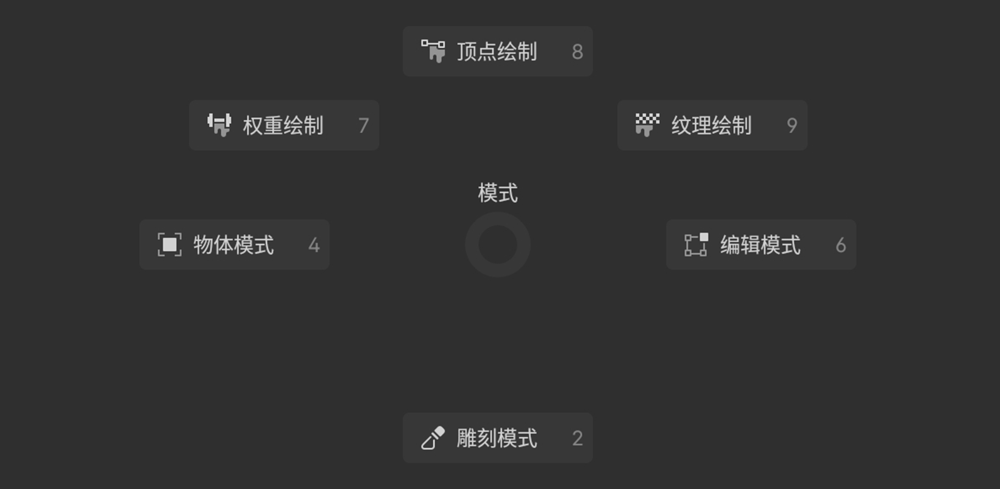

## 模式切换(Tab)

> 自由切换物体的各种模式.

## 快速旋转(Alt+Q)

> 快速旋转、镜像、复制物体&网格.

## 轴心点、坐标系(C拖拽)

> 设置变换坐标系、轴心点，测量，编辑模式显示网格边长数据.

## 保存(Ctrl+S)

> 保存、打开、新建文件，导入导出OBJ、Stl、DXF，追加、关联物体，打开自动保存文件夹.

## 着色饼菜单(C)

> 快速切换视图着色模式,实体/线框材质/渲染模式都可以再点击一次切换覆盖,隐藏除网格外的其他物体.

## 新建窗口(Ctrl+回车)

> 复制新窗口、更改窗口类型、关闭窗口.
