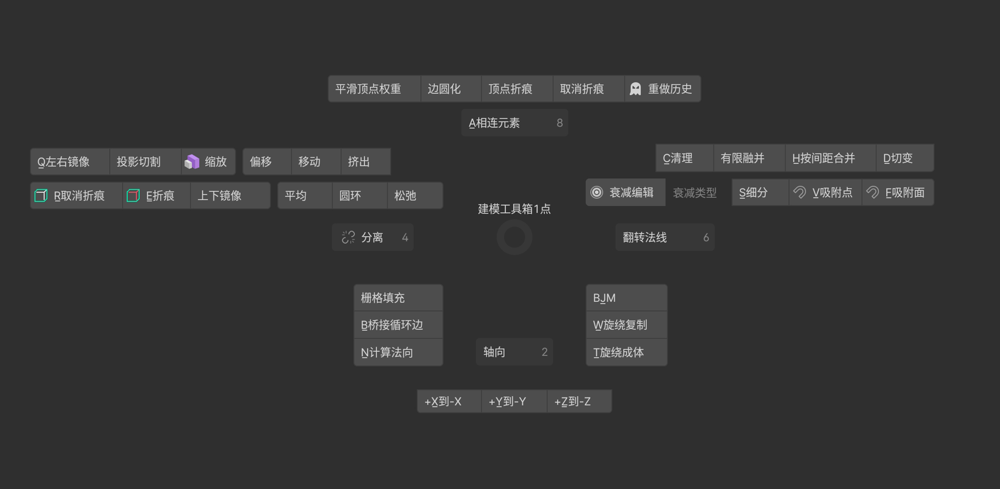
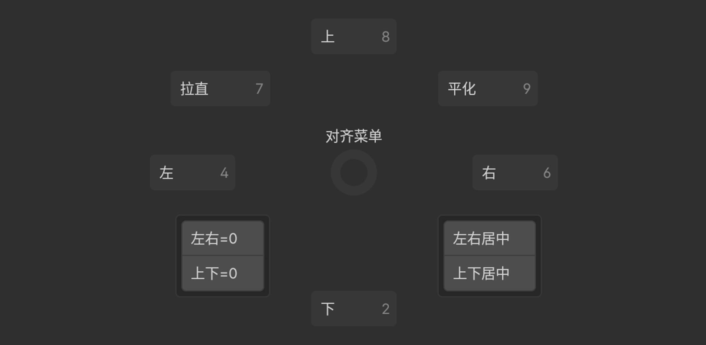
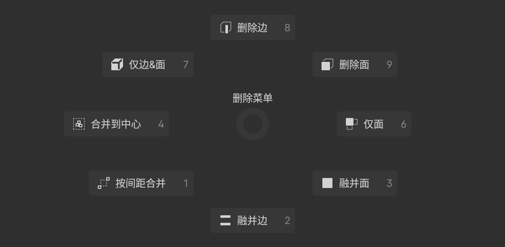
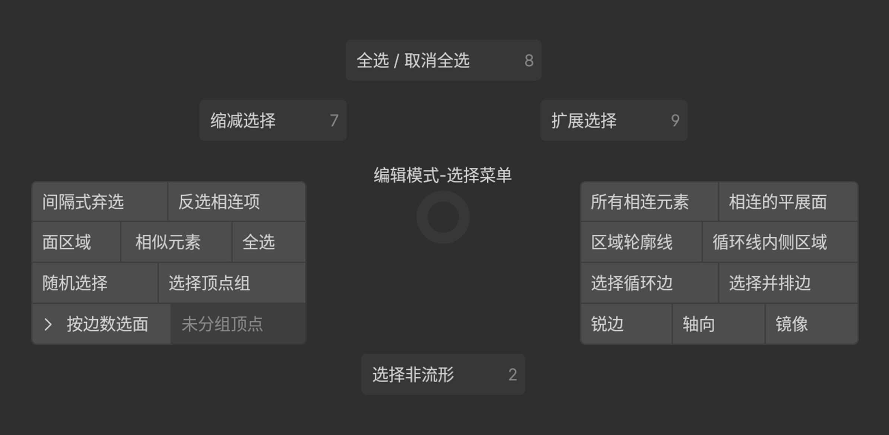
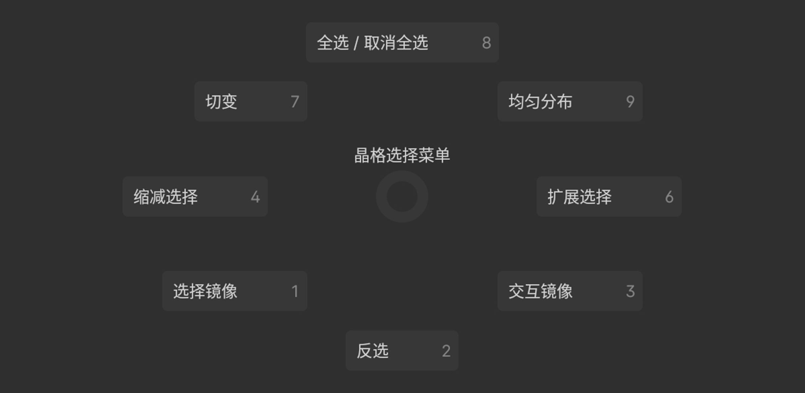
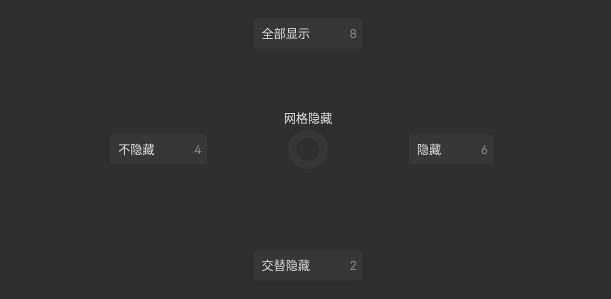

## 建模工具箱（Q）

> 点模式工具箱，线/面模式上方略有不同.

- QA:相连元素 `选择与选中项相连的全部顶点.`
- QQ:左右镜像 `以轴心点为变换中心,从当前视图左右镜像选中的顶点,并取消锁定轴向.`
- QC:清理 `一键清理活动物体的全部网格,无须选中点/线/面.`
- QH:按间距合并`按间距合并选中的顶点.`
- QD:切变`切换到切变工具.`
- QE:折痕 `折痕选中网格的循环边.`
- QR:取消折痕 `取消选中网格的全部折痕属性.`
- QS:细分 `细分所选边线.`
- QV,QF:吸附点/面 `同物体模式,一键设置吸附点/面的快速预设,并开启吸附功能.`
- QB:桥接循环边 `在两个或多个选定循环边之间创建桥接面.`
- QN:计算法向 `使面与点的法线朝向网格外侧或内侧.`
- QW:旋绕复制 `在当前视图中，以游标为中心复制选中的网格.`
- QT:旋绕成体 `在当前视图中，以游标为中心挤出选中的循环点.`
- QX:+X到-X `强制沿轴对称(包括形状及拓扑结构):+X到-X.`
- QY,QZ:仅Z/Y轴 `锁定其他两个轴,仅Z/Y轴可变换.`

## 对齐菜单(Alt+A)

> 以视图为基准进行网格对齐.

## 删除菜单(X拖拽)

> 快速删除/融并网格点/线/面.

## 选择菜单(A拖拽)

> 按类型/点数/拓扑结构选择网格.

##### 晶格选择菜单(A拖拽)

> 晶格编辑模式下的选择菜单.

## 网格隐藏(H)

> 隐藏/显示/交替隐藏网格.

## UV菜单(U)

  
  

    <strong style="color:gray;">UU快速打开/关闭UV编辑器(光标需放在3D视图),按类型展开/重置UV,标记/清除缝合边.</strong>
  

